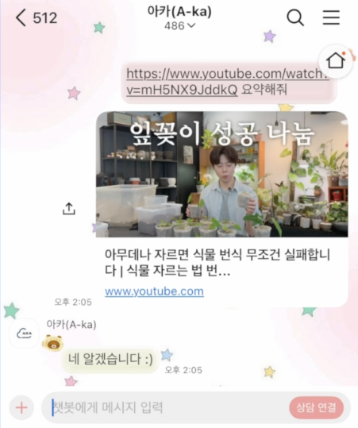
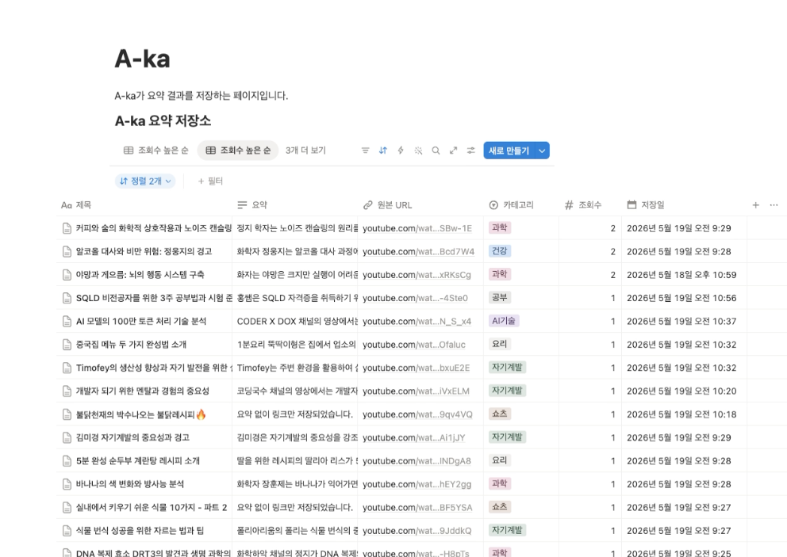
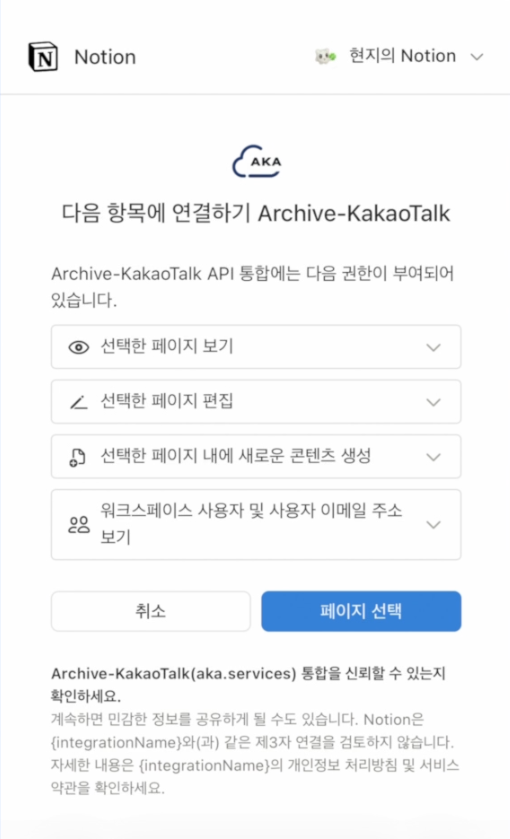
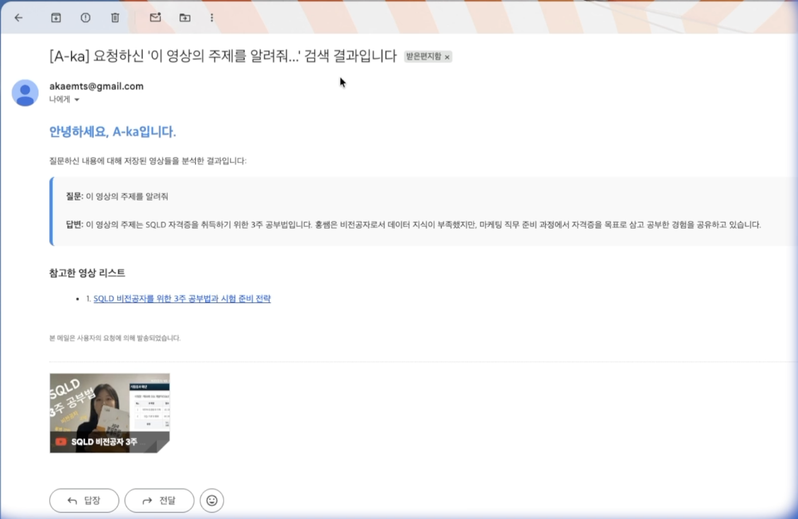
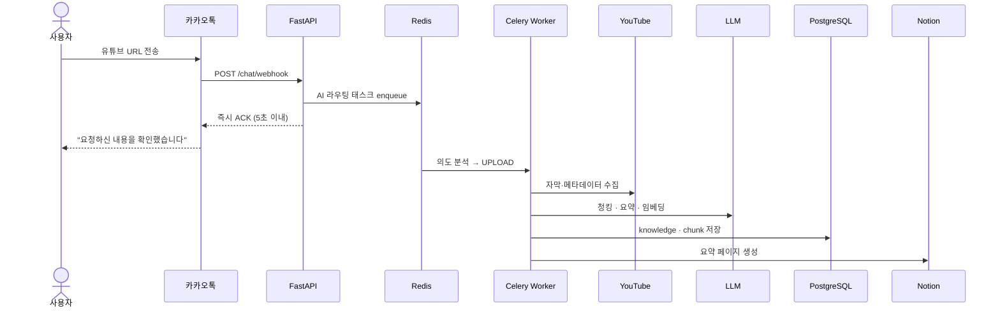
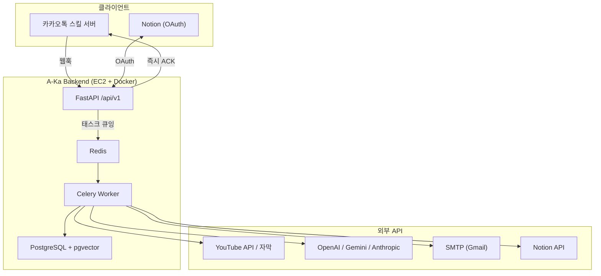
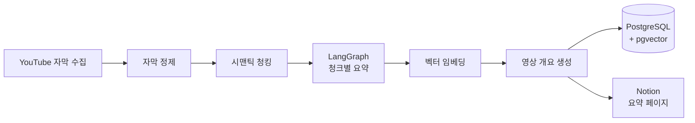
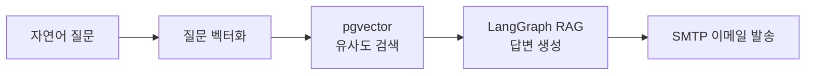

# A-Ka

> 카카오톡에서 유튜브 링크를 내면, AI가 요약·분류·검색하고 Notion에 정리해 주는 **개인 지식 관리 서비스**의 백엔드

---

## 한 줄 요약

**A-Ka**는 사용자가 일상적으로 소비하는 유튜브 콘텐츠를 대화형 인터페이스(카카오톡)로 수집하고, LLM·벡터 검색으로 가공한 뒤 Notion 워크스페이스에 자동 동기화하는 지식 관리 플랫폼입니다.

| 항목 | 내용 |
|------|------|
| 서비스 형태 | 카카오톡 챗봇 + Notion 연동 |
| 저장소 | [A-ka_backend](.) — FastAPI 백엔드 |
| 주요 사용자 | 유튜브로 학습·정보를 수집하고 Notion에 체계적으로 쌓고 싶은 개인 사용자 |

---

## 시각 자료

백엔드 저장소만으로는 UI가 코드에 없기 때문에, Org README에는 **스크린샷 + 다이어그램**을 함께 두는 것을 권장합니다.

### 서비스 화면

> 이미지는 [`docs/assets/`](assets/)에 추가합니다. 캡처 가이드는 [`assets/README.md`](assets/README.md)를 참고하세요.

| 카카오톡 — 링크 전송 & ACK | Notion — 자동 요약 페이지 |
|:---:|:---:|
|  |  |
| 유튜브 URL을 내면 5초 이내 확인 메시지를 받고, 요약은 백그라운드에서 처리 | AI가 생성한 개요·청크 요약이 Notion 페이지로 동기화 |

| 카카오톡 — Notion 연동 | (선택) 검색 결과 이메일 |
|:---:|:---:|
|  |  |
| textCard 버튼 → 브릿지 페이지 → 외부 브라우저 OAuth | 자연어 질문에 대한 답변을 이메일로 수신 |

### 핵심 흐름 (시퀀스)

카카오 스킬 서버 **5초 응답 제한**을 지키기 위해, 웹훅은 ACK만 반환하고 실제 처리는 Celery가 담당합니다.



---

## 배경 · 문제

- 유튜브에서 유용한 영상을 보더라도 **나중에 다시 찾기 어렵고**, 시청 내용을 **구조화해 보관하기 어렵다**
- 링크만 북마크해 두면 **내용 검색·비교·재활용**이 불가능하다
- Notion에 수동으로 옮기려면 **자막 확인 → 요약 → 페이지 작성** 과정이 반복적이고 시간이 많이 든다

## 솔루션

카카오톡에 **유튜브 URL 또는 자연어 질문**만내면, 백엔드가 의도를 파악하고 비동기로 처리한다.

| 사용자 행동 | 시스템 동작 |
|-------------|-------------|
| 유튜브 링크 전송 | 자막 수집 → AI 요약 → 카테고리 분류 → DB·Notion 저장 |
| "와인 두통 관련 내용 알려줘" | 저장된 지식 DB에서 RAG 검색 → 답변 생성 → 이메일 발송 |
| "이 영상이랑 비슷한 거 찾아줘" | 기준 영상 임베딩으로 유사 콘텐츠 탐색 |
| "나중에 볼게" + 링크 | 요약 없이 Notion에 링크만 저장 (쇼츠 포함) |
| Notion 연동 요청 | OAuth 브릿지 페이지로 워크스페이스 연결 |

---

## 사용자 시나리오

### 1. 온보딩 — Notion 연동

1. 카카오톡에서 "Notion 연동" 스킬 호출
2. 브릿지 페이지를 통해 외부 브라우저에서 Notion OAuth 진행
3. 연동 완료 후 요약 페이지가 자동 생성되는 부모 페이지 지정 가능

### 2. 영상 요약 적재 (UPLOAD)

1. 카카오톡에 `https://youtu.be/...` 전송
2. 즉시 ACK 응답 ("요청하신 내용을 확인했습니다")
3. 백그라운드에서 자막 → 시맨틱 청킹 → 청크별 요약 → 전체 개요 생성
4. PostgreSQL + pgvector에 저장, Notion에 요약 페이지 생성

### 3. 지식 검색 (SEARCH)

1. "재테크 관련해서 예전에 본 영상 내용 알려줘" 등 자연어 질문
2. 질문 벡터화 → 사용자별 지식 청크 유사도 검색 (RAG)
3. LLM이 검색된 청크를 근거로 답변 생성
4. 결과를 이메일로 발송

### 4. 유사 영상 탐색 (FIND_SIMILAR)

1. 기준 영상 URL + "비슷한 영상 찾아줘"
2. 해당 영상 임베딩과 저장 DB 비교
3. 관련도 높은 영상 목록 반환

### 5. 링크만 저장 (SAVE_ONLY)

1. "나중에 볼게 https://..." 또는 쇼츠 링크
2. 요약 파이프라인 없이 Notion에 URL·메타데이터만 기록

---

## 시스템 아키텍처



### 레이어 구조

| 레이어 | 역할 | 주요 모듈 |
|--------|------|-----------|
| Presentation | HTTP 라우팅, 요청 검증 | `app/routers/endpoints/` |
| Business | 의도 분석, 파이프라인, Notion·검색 로직 | `app/services/` |
| Task | 비동기·장시간 작업 | `app/tasks/` |
| Data | ORM, 벡터 저장·조회 | `app/repositories/`, `app/models/` |
| Core | 설정, 인증, LLM, Celery | `app/core/` |

---

## AI · 데이터 파이프라인

### 의도 분석 (AI Router)

카카오 메시지는 Celery `router_tasks`로 넘어가 `ChatCommandService`가 LLM 구조화 출력으로 의도를 분류한다.

| Intent | 설명 |
|--------|------|
| `UPLOAD` | 유튜브 URL 요약·적재 |
| `SEARCH` | 저장된 지식 기반 RAG 질의 |
| `FIND_SIMILAR` | 유사 영상 탐색 |
| `SAVE_ONLY` | 링크만 Notion 저장 |
| `UNKNOWN` | 분류 불가 발화 |

### 지식 파이프라인 (UPLOAD)



### 검색 파이프라인 (SEARCH)



### LLM 구성

- **기본 프로바이더**: OpenAI (`gpt-4o-mini`, `text-embedding-3-small`)
- **폴백**: Gemini, Anthropic (키 설정 시)
- **오케스트레이션**: LangGraph + LangSmith 트레이싱(선택)

---

## 데이터 모델

ERD 정의: [`erd.dbml`](../erd.dbml)

| 테이블 | 설명 |
|--------|------|
| `user` | 내부 사용자 |
| `user_channel_identity` | 카카오 등 외부 채널 ID 매핑 |
| `category` | 지식 카테고리 (AI 자동 분류) |
| `knowledge` | 지식 단위 (제목, URL, 요약, 상태, hit_count) |
| `youtube_metadata` | 영상 ID, 채널, 길이 등 |
| `knowledge_chunk` | 청크 본문·세부 요약·임베딩·타임스탬프 |
| `notion_connection` | 사용자별 Notion OAuth 토큰·부모 페이지 |

`knowledge_chunk.embedding`은 pgvector로 저장되어 사용자별 시맨틱 검색에 사용된다.

---

## 외부 연동

| 서비스 | 용도 |
|--------|------|
| **카카오톡** | 스킬 서버 웹훅 (`POST /api/v1/chat/webhook`) |
| **Notion** | OAuth 2.0, 페이지·DB 생성, 검색 |
| **YouTube** | 메타데이터 API, 자막 API, yt-dlp, Whisper(STT 폴백) |
| **OpenAI** | 채팅, 임베딩, 구조화 출력 |
| **SMTP** | 처리 오류·검색 결과 알림 |

---

## 기술 스택

| 분류 | 기술 |
|------|------|
| Language | Python 3.12 |
| Web Framework | FastAPI, Uvicorn |
| ORM / Migration | SQLAlchemy 2.x, Alembic |
| Database | PostgreSQL 16, pgvector |
| Message Queue | Celery 5, Redis 7 |
| AI / LLM | LangGraph, LangChain, OpenAI SDK |
| Auth | JWT, 카카오 user_id 기반 사용자 식별 |
| Package Manager | uv |
| Infra | Docker, Docker Compose, GitHub Actions → AWS EC2 |

---

## 인프라 · 배포

- **로컬**: `docker-compose.yml` — web, worker, db(pgvector), redis
- **운영**: `docker-compose.prod.yml` + `.env.prod`
- **CI/CD**: `main` 브랜치 push → GitHub Actions SSH → EC2에서 `docker compose` 재빌드·기동
- **API 문서**: FastAPI 자동 생성 (`/docs`)

---

## 레포지토리 구성

```
A-ka_backend/          ← 본 저장소 (백엔드)
├── app/               애플리케이션 코드
├── alembic/           DB 마이그레이션
├── erd.dbml           ERD
├── docker-compose*.yml
└── .github/workflows/ 배포 워크플로
```

개발·실행 가이드는 루트 [`README.md`](../README.md)를 참고한다.

---

## 핵심 설계 포인트

1. **카카오 5초 응답 제한 대응** — 웹훅은 즉시 ACK만 반환하고, 모든 AI·DB 작업은 Celery 워커로 분리
2. **사용자별 데이터 격리** — 검색·유사 탐색은 `user_id` 기준으로만 조회
3. **중복 영상 처리** — 동일 `video_id` 재전송 시 `hit_count` 증가, FAILED 상태는 재처리 허용
4. **쇼츠 특수 처리** — Shorts URL은 요약 없이 SAVE_ONLY 흐름으로 분기
5. **Notion OAuth 브릿지** — 카카오 인앱 브라우저 제약을 우회하는 HTML 브릿지 페이지 제공
6. **LLM 프로바이더 폴백** — OpenAI 장애 시 Gemini·Anthropic 순차 시도

---

## API 엔드포인트 요약

접두사: `/api/v1`

| 영역 | 대표 엔드포인트 |
|------|-----------------|
| 인증 | `POST /auth/login/local`, `GET /auth/me` |
| 카카오 | `POST /chat/webhook` |
| 카카오·Notion | `POST /kakao/notion/oauth/start`, `GET /kakao/notion/oauth/bridge` |
| Notion | `GET /notion/oauth/start`, `GET /notion/oauth/callback`, `GET /notion/me` |
| YouTube | `POST /youtube/summarize`, `GET /youtube/transcript` |
| 디버그 | `GET /debug/graph/{graph_name}` |

---

## 관련 문서

| 문서 | 설명 |
|------|------|
| [README.md](../README.md) | 개발 환경 설정, 실행, 테스트 |
| [assets/README.md](assets/README.md) | 스크린샷 캡처 가이드 |
| [erd.dbml](../erd.dbml) | 데이터베이스 ERD |
| [app/core/config.py](../app/core/config.py) | 환경 변수 전체 목록 |
| [.env.example](../.env.example) | 환경 변수 템플릿 |

---

## 키워드

`카카오톡 챗봇` · `유튜브 요약` · `Notion 연동` · `RAG` · `pgvector` · `LangGraph` · `Celery` · `지식 관리` · `FastAPI`
